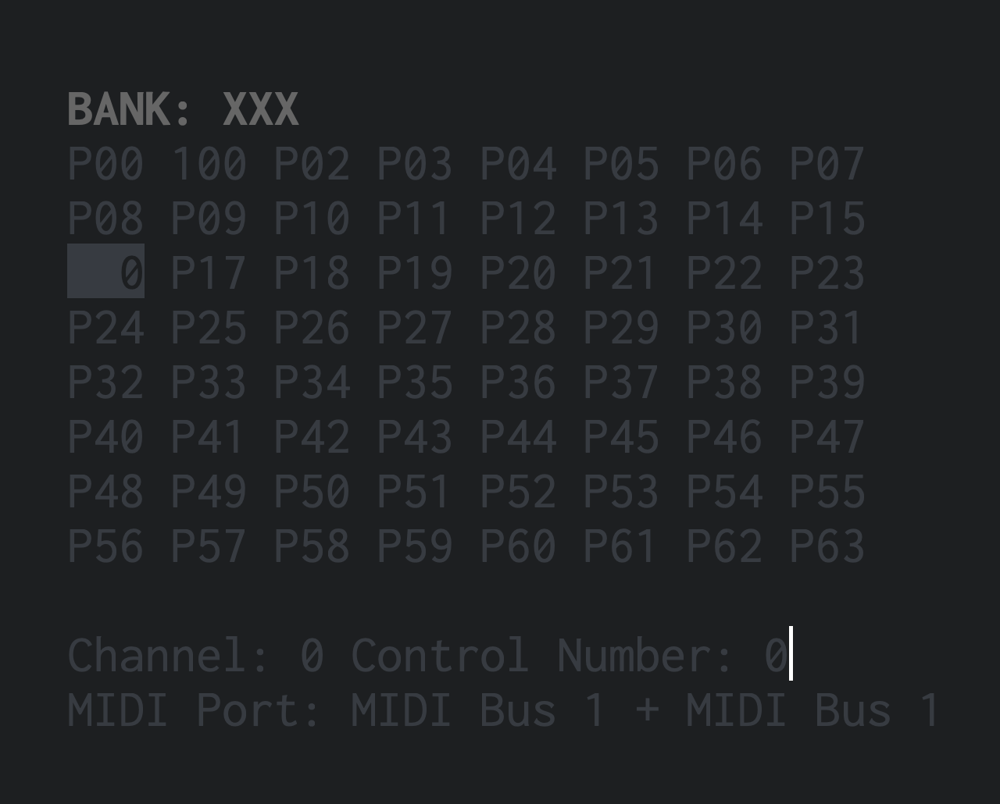

# SliderWolf



SliderWolf is a terminal-based application that allows users to edit MIDI parameters in a simple grid-like interface. It supports creating and switching between multiple banks, renaming parameters, and changing parameter values, MIDI channels, and control numbers.

## Features
- Terminal-based interface for quick and efficient editing
- 8x8 grid layout for easy parameter visualization and navigation
- Support for multiple banks with custom parameter names
- Edit parameter values, MIDI channels, and control numbers
- Auto-saving of application state

## Installation

- To install the MIDI Parameter Editor, first ensure you have Python 3.7 or newer installed on your system. Then, clone this repository to your local machine:

```shell
git clone https://github.com/Bubobubobubobubo/sliderwolf
cd sliderwolf
```

- (Optional) Create and activate a virtual environment:

```shell
python3 -m venv venv
source venv/bin/activate  # On Windows, use `venv\Scripts\activate`
```

Install the required dependencies:

```shell
uv sync
```

# Usage


To run the program, execute the following command from the root directory of the repository:

```shell
uv run python -m sliderwolf
```

Use the arrow keys to navigate the grid, and the following keys to perform actions:

- `v`: Change the value of the currently selected parameter
- `+`: Increment the value of the currently selected parameter
- `-`: Decrement the value of the currently selected parameter
- `r`: Rename the currently selected parameter
- `n`: Edit the control number of the currently selected parameter
- `c`: Edit the channel of the currently selected parameter
- `b`: Switch to another bank or create a new one
- `x`: Reset the current parameter bank
- `q`: Quit the application

When prompted to input values, type the desired value and press Enter. If you don't want to make changes, just press Enter without typing anything.

## Contributing

If you would like to contribute to SliderWolf, feel free to fork the repository and submit a pull request with your changes. We're always open to improvements and new ideas.

## License

This project is licensed under the MIT License. See the `LICENSE` file for details.
